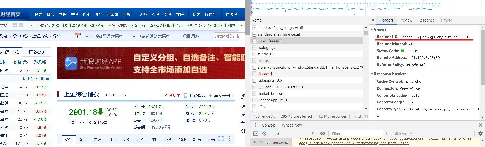
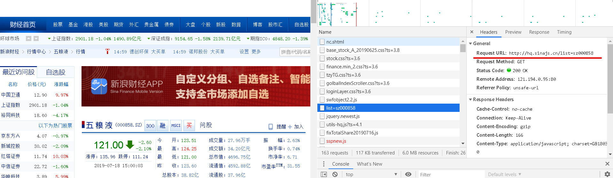
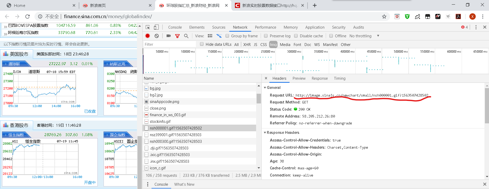

# StockPage
利用python request库爬取新浪网其中一些大盘的数据，并显示到网页上。利用Flask库作为后台管理库并部署到服务器。

详细可以预览网站：http://39.108.228.47:1020/stock

## 一、获取数据

首先还是分析新浪网，现在的网页基本的数据基本上都是用JS进行传递，直接爬取过于复杂，所以用request库去截取传递的数据这样的方式是最方便的，可以看看新浪网页上的对应数据是从何而来有什么样的规律。
F12在Chrome中打开调试，在network中找到想要的数据，可以看到上证指数的来源是一个这样的请求(红线标注的地方)：

可以再找另一个数据，随便找一个股票，同样找数据：

可以发现，所有的request请求是一个这样的结构：

    http://hq.sinajs.cn/list= + 股票代码

然后是返回的数据，这个就很简单了，一个JSON的数据，按照Python的字典的那种方式就可以处理了。

再看一看图片的请求,在股指汇总的页面里面有一大堆我们的目标，但是发现这里的图片是小图片，放到网页上是放大的，很不好看，于是就搜了一下别人总结的接口网址：

    查看K线图：
    http://image.sinajs.cn/newchart/daily/n/sh601006.gif
    K线的话根据分析是这样的一个格式：
    http://image.sinajs.cn/newchart/单位/n/股票代码.gif

    分时线
    http://image.sinajs.cn/newchart/min/n/sh000001.gif
    分时线的话根据分析是这样的一个格式：
    http://image.sinajs.cn/newchart/min/n/股票代码.gif

到此我们的数据获取的工作就完成了。

## 二、后端代码

后端的代码主要就是两个方面，一个部分是爬取数据的部分，另一个部分就是Flask库进行网页的后台部署。

Flask的处理结构很简单，首先需要一个主入口，输入自己的服务器公网IP和一个端口就行:

    app = Flask(__name__)
    app.run("服务器公网IP",端口)

这样就算服务器启动了，服务器启动当然还有一大堆的参数，详细的可以参见Flask的官方网站。

然后是Flask的响应模块，具体的格式就三个主要的东西，一个是获取GET还是POST，一个就是响应的地址，一个是执行的操作：

    @app.route("/stock", methods=['GET', 'POST'])
    def function():
        if request.method == '根据需求填GET或者POST':
            return render_template('想要转换的页面')

这里要注意的是，按照Flask的的部署方式，网站的页面要按照他给定的格式放置，一般是两个部分，一个是static放一些脚本文件、数据，另一个是templates放静态页面，我这里把爬取到的数据和图片都放在static的文件里的，然后通过Flask的 render_templates 函数可以定向到页面，然后在页面里面，通过url_for的函数来查找要找的文件，例如：

     src="{{ url_for('static',filename = 'js/bootstrap.min.js')}}"

这样的话就意味着静态页面在写完了之后会经历一波大概，所以在这里建议还是在后端编写完成的情况下编写前端网页，能省心不少。

## 三、部署到服务器
我的服务器是阿里云的轻量应用服务器，基本够用。我是在本地编写的代码，所以说得把整个程序复制过去，我知道的有两种方法，一个就是用Git，clone到服务器的就OK，很方便。但是为了平常和服务器的连接，我用了Putty+WinSCP的应用组合（有钱的朋友可以选择Xshell+Xfttp，当然学生党可以申请免费版），Putty是利用SSH通道连接服务器用的，WinSCP是传文件用的，两者结合，无敌！就是长时间没有动作就容易掉线。。。。。。

到了服务器就 cd 到你的文件夹，然后用python启动就可以了。

后来试了试，关掉终端之后服务也就关闭了，查了查说是关闭终端的时候服务器会关闭一些不明不白的进程，也就是说，我们在运行的时候应该让他在后台一直运转才对，我的是Linux的服务器，所以执行一下命令即可：

    nohup python main.py &

注意后面的 & 一定不能掉，nohup命令是让终端关闭的时候不检查这条命令，而 & 才是让这条命令后台循环运行的奥秘所在。

但是这样以后我发现还是不行，因为这样并不能算执行完这条语句，输入这条语句以后应该先退出nohup，再关闭终端，退出就很简单，回车键就好了，然后就可以关闭终端了。

# 结束，收工！
